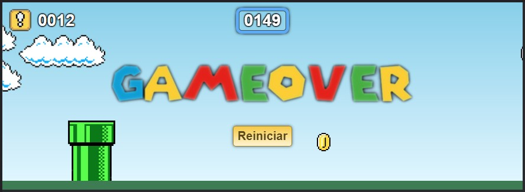
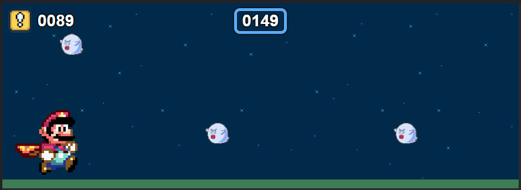
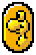
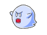

# Mario Run

Jogo simples no estilo Chrome Dino (aquele do seu navegador quando a internet cai) com a temática do Mario Bros feito usando apenas CSS e Javascript básicos.

Use qualquer tecla para pular o cano e/ou para reiniciar a partida. Funciona com clicks do mouse ou toque na tela do aparelho.

Caso queira ver o jogo em ação, **ligue o som** e click na sua versão preferida:

- [Versão 1 a 3](http://52.11.182.22/mario/): A pontuação é feita pelo tempo.
- [Versão 4+](http://52.11.182.22/mario2/): A pontuação é feita por moedas coletadas.

## Jogabilidade (Versão 4+)

|                                                     Imagem                                                     | Descrição                                                                                                                                                                                                                                                                    |
|:--------------------------------------------------------------------------------------------------------------:|------------------------------------------------------------------------------------------------------------------------------------------------------------------------------------------------------------------------------------------------------------------------------|
|                                                               | A moeda concede 1 ponto quando você a pega. Se a moeda estiver no alto, concede 2 pontos                                                                                                                                                                                     |
|                                                | A moeda do Yoshi concede 5 pontos para você.                                                                                                                                                                                                                                 |
|                                                            | Após conseguir alguns pontos, em algum momento aparecerá esse ovo. Ao pegar, o Mário ganha o Yoshi!                                                                                                                                                                          |
|                                              | Quando o Mário estiver com o Yoshi, todo ponto será dobrado! E se bater em algo (Canos ou Fantasmas) em vez de ser penalizado, você perde o Yoshi.                                                                                                                           |
|  | Tanto o cano como o Bowser são obstáculos. Se bater neles o jogo acaba (a menos que esteja com o Yoshi). O Bowser aparece de vez em quando, mas ele é bem rápido, cuidado!                                                                                                   |
|                                                             | Quando fica de noite, os fantasmas aparecem. Tocar neles fará com que você perca 2 pontos (se estiver com o Yoshi, você perde 1 ponto e também perde o Yoshi... o Yoshi morre de medo de fantasmas! Mas tudo bem, o Bowser também não gosta, e por isso nem aparece a noite) |

---

A pontuação atual fica no canto superior esquerdo da tela. Ao passo que no centro da tela, no alto, fica sua pontuação máxima. Para zerar a pontuação máxima, basta tocar/clicar nela.

Enjoy! :)

---

_Obs: Aprimoramento feito a partir da idéia de um [vídeo](https://youtu.be/r9buAwVBDhA) no canal [Manual do Dev](https://www.youtube.com/c/ManualdoDev), no Youtube._
